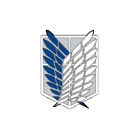

<div align="center">


</div>

---

<div align="center">

### Hola, soy Raúl

Técnico en **Sistemas Microinformáticos y Redes** y desarrollador **Full Stack Web** con el grado superior en **Desarrollo de Aplicaciones Web**.  
Me apasiona construir productos digitales de calidad, aprender constantemente y trabajar en equipo para llevar las ideas al siguiente nivel.

[](mailto:verdejomartinraul@gmail.com)

</div>

---

## Sobre mí

```js
const raul = {
  nombre:    "Raúl Verdejo Martín",
  rol:       ["Full Stack Developer", "Técnico en SMR"],
  formación: ["CFGM Sistemas Microinformáticos y Redes", "CFGS Desarrollo de Aplicaciones Web"],
  idiomas:   { español: "Nativo", inglés: "Básico" },
  mentalidad: "Aprendizaje continuo · Trabajo en equipo · Mejora constante",
  buscando:  "Nuevos retos donde crecer y aportar valor.",
};
```

---

## Stack Tecnológico

### Frontend


### Backend


### DevOps & Infraestructura


### Herramientas


---

## Puntos fuertes

| Trabajo en equipo | Aprendizaje continuo | Atención al detalle |
|:---:|:---:|:---:|
| Disfruto colaborando, compartiendo conocimiento y construyendo junto a otros | Siempre buscando mejorar, explorar nuevas tecnologías y mantenerme actualizado | Cuido cada detalle del código y la experiencia de usuario |

---

## GitHub Stats

<div align="center">


</div>

---

## Contacto

<div align="center">

¿Tienes un proyecto en mente, quieres colaborar o simplemente charlar sobre tecnología?  
**¡Escríbeme, estaré encantado de leerlo!**

[](mailto:verdejomartinraul@gmail.com)

</div>

---

<div align="center">


<div align="center">
  
</div>

</div>
